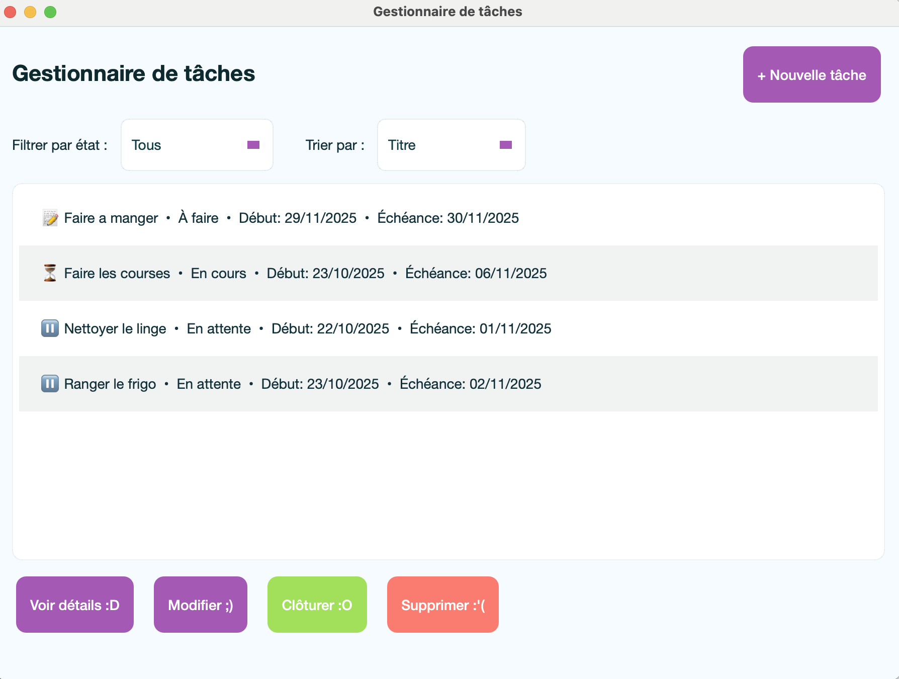
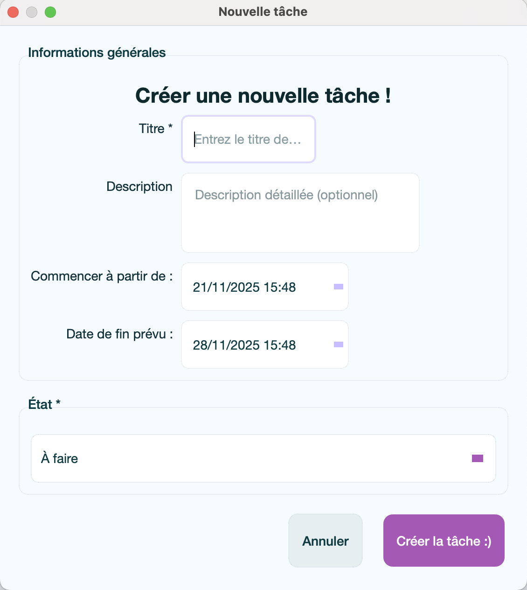
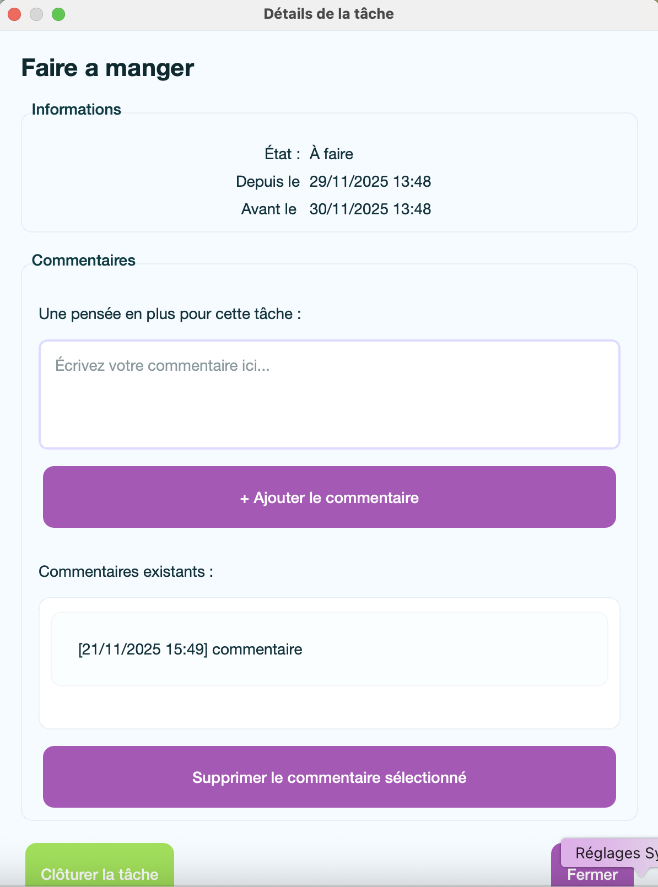
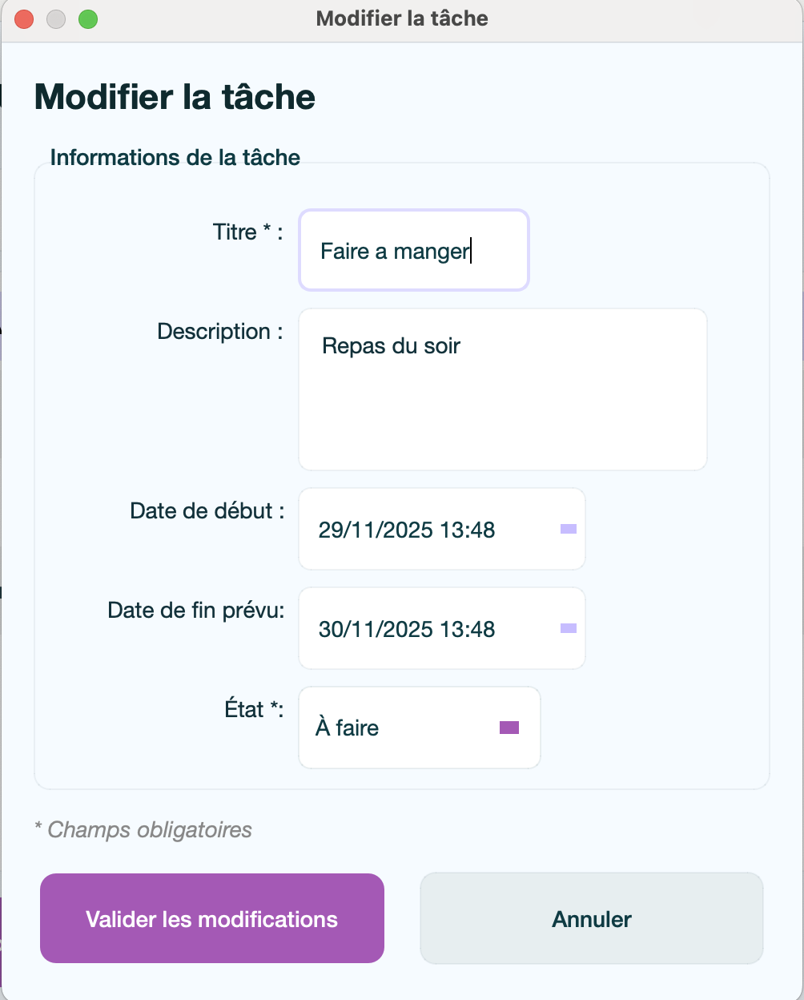

Gestionnaire de Tâches

Application de gestion de tâches avec interface graphique développée avec PySide6 (Qt pour Python)

 Fonctionnalités

- Créer, éditer et supprimer des tâches avec titre, description et dates
- 5 états de tâche : À faire, En cours, Réalisé, Abandonné, En attente
- Système de commentaires pour chaque tâche
- Filtrage par état et tri (date de début, date de fin, titre)
- Gestion des échéances
- Persistance automatique des données en JSON
- Interface personnalisable via fichier QSS (feuille de style Qt)

 Aperçu

Page d'accueil


Page de création 


Détails d'une tache :


Modifier une tahce :



Architecture

Le projet suit le pattern MVC (Model-View-Controller) :

- Models (`models/`) : Logique métier (`Task`, `Comment`)
- Views (`views/`) : Interface graphique (fichiers `.ui` + wrappers Python)
- Controllers (`controllers/`) : Orchestration entre vues et modèles
- Database (`utils/`) : Persistance des données (actuellement JSON)

 Structure du projet

```
gestionnaire_tache/
├── main.py                    # Point d'entrée
├── models/                    # Modèles de données
│   ├── task.py               # Classe Task + enum EtatTache
│   └── comment.py            # Classe Comment
├── views/                     # Interface utilisateur
│   ├── main_window.py        # Fenêtre principale
│   ├── dialogs/              # Dialogues (création, édition, détail)
│   ├── ui/                   # Fichiers Qt Designer (.ui)
│   └── generated/            # Code Python auto-généré (ne pas éditer)
├── controllers/               # Logique de contrôle
│   └── task_controller.py    # CRUD des tâches
├── utils/                     # Utilitaires
│   └── database.py           # Interface database
├── styles/                    # Feuilles de style
│   └── style.qss             # Thème visuel
└── data/                      # Données
    └── tasks.json            # Base de données JSON
```

Comment lancer le projet

 Prérequis

- Python 3.9+ installé sur votre système
- macOS, Linux ou Windows

 Lancement rapide

```zsh
# 1. Aller dans le dossier du projet
cd ../gestionnaire_tache

# 2. Activer l'environnement virtuel
source env/bin/activate          # macOS/Linux
# .\env\Scripts\Activate.ps1     # Windows PowerShell

# 3. Lancer l'application
python main.py
```

Si le dossier env/ n'existe pas, suivez la section ci-dessous :

Démarrez le projet pour la première fois :

```zsh
# 1. Cloner ou télécharger le projet
cd /chemin/vers/gestionnaire_tache

# 2. Créer l'environnement virtuel
python3 -m venv env

# 3. Activer l'environnement virtuel
source env/bin/activate          # macOS/Linux
# .\env\Scripts\Activate.ps1     # Windows PowerShell

# 4. Installer les dépendances
pip install -r requirements.txt

# 5. Lancer l'application
python main.py
```


Arrêter l'application

- Fermez simplement la fenêtre de l'application
- Pour désactiver l'environnement virtuel : `deactivate`

Personnalisation du style

Modifier les couleurs et l'apparence

Le fichier styles/style.qss contient toute la feuille de style de l'application.

Pour modifier le thème :
1. Ouvrez styles/style.qss dans votre éditeur
2. Modifiez les couleurs, tailles, espacements, etc.
3. Sauvegardez le fichier
4. Relancez l'application pour voir les changements

Il n'y a pas de hot-reload, il faut redémarrer l'app après chaque modification

Développement avec Qt Designer

Qt Designer permet d'éditer visuellement les interfaces (fichiers `.ui`).

Utiliser le Designer inclus dans PySide6

```zsh
env/bin/pyside6-designer
```

Workflow de modification d'interface

1. Ouvrez le fichier `.ui` dans Qt Designer (dans `views/ui/`)
2. Modifiez l'interface visuellement
3. Sauvegardez le fichier `.ui`
4. Régénérez le code Python :

```zsh
pyside6-uic views/ui/main_window.ui -o views/generated/ui_main_window.py
pyside6-uic views/ui/dialog_creation_tache.ui -o views/generated/ui_dialog_creation_tache.py
pyside6-uic views/ui/dialog_edition_tache.ui -o views/generated/ui_dialog_edition_tache.py
pyside6-uic views/ui/dialog_detail_tache.ui -o views/generated/ui_dialog_detail_tache.py
```

Relancez l'application pour voir les changements

Ne jamais éditer manuellement les fichiers dans `views/generated/`

Utilisation

Gestion des tâches

1. Créer une tâche : Cliquez sur "Nouveau" et remplissez le formulaire
2. Voir les détails : Double-cliquez sur une tâche ou sélectionnez + "Voir détails"
3. Modifier : Sélectionnez une tâche et cliquez sur "Modifier"
4. Clôturer : Marque la tâche comme "Réalisé" avec date de fin automatique
5. Supprimer : Supprime définitivement la tâche (avec confirmation)

 États disponibles

- 📝 À faire : Tâche non commencée
- ⏳ En cours : Tâche en cours de réalisation
- ✅ Réalisé : Tâche terminée
- ❌ Abandonné : Tâche abandonnée
- ⏸️ En attente : Tâche en pause

 Filtres et tri

- Filtrer par état : Menu déroulant pour afficher uniquement certains états
- Trier : Par titre, date de début, date de fin ou état

 Commentaires

Dans la vue détaillée d'une tâche, il est possible :
- Ajouter des commentaires avec horodatage automatique
- Supprimer des commentaires existants
- Voir tous les commentaires des notes sur la tâche

Stockage des données

Les données sont sauvegardées automatiquement dans `data/tasks.json` au format JSON.

Structure :
```json
{
  "tasks": [
    {
      "id": "uuid",
      "titre": "La tâche",
      "description": "Description détaillée",
      "date_debut": "2025-11-21T10:00:00",
      "date_fin": "2025-11-28T18:00:00",
      "etat": "En cours",
      "commentaires": []
    }
  ]
}
```

Le fichier est créé automatiquement au premier lancement s'il n'existe pas

Technologies utilisées

- [PySide6](https://doc.qt.io/qtforpython/) (≥6.6.0) : Framework Qt pour Python
- Python 3.9+ : Langage de programmation
- Qt Designer : Éditeur visuel d'interfaces
- JSON : Format de stockage des données

